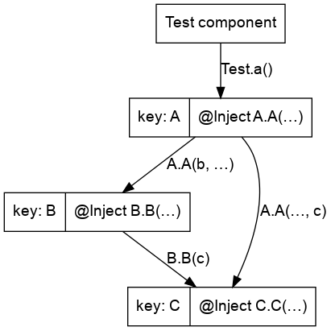

## Status: DRAFT

## Definition:

A _binding graph_ comprises the [bindings][binding] and
[dependency requests][dependency request] that are used to implement a
[component]. It is a [directed graph] with an edge for each
[dependency request], whose target is the [binding] that satisfies the request,
and whose source is either the binding that contains the request or, in the case
of [entry points][entry point], the [component] that contains the [entry point].

For example, look at the following component:

```java
@Component
interface Test {
  A a();
}

class A {
  @Inject A(B b, C c) {}
}

class B {
  @Inject B(C c) {}
}

class C {
  @Inject C() {}
}
```

The binding graph for `TestComponent` is below. There is one entry point,
represented by an edge from the `Test` component node.



Note that each [binding] is associated with a [key], which matches the [key] of
the incoming [dependency request].

[binding]: binding.md
[component]: component.md
[dependency request]: dependency_request.md
[directed graph]: https://en.wikipedia.org/wiki/Directed_graph
[entry point]: entry_point.md
[key]: key.md
